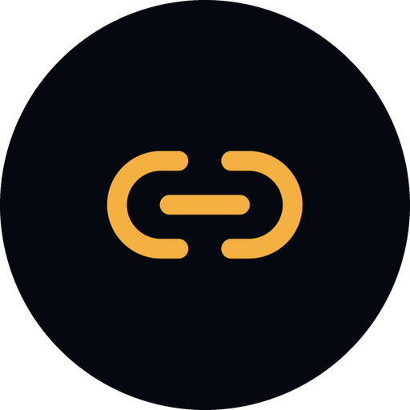

<div align="center">
  

# LinkTrace

**Healthy links. Higher rankings.**

</div>

Open-source **distributed** site auditor. Give it a domain; it BFS-crawls every internal link from the homepage out and reports:

- broken links, each with a reason (DNS, timeout, SSL, soft 404, 4xx/5xx, redirect loop)
- an on-page SEO audit and score for every healthy page
- the whole site as an interactive graph
- per-category rollups, site checks, crawl stats, and sitemap coverage

## Architecture

- **api** (`cmd/api`): HTTP server. Creates jobs, serves reports. No crawling.
- **worker** (`cmd/worker`): crawl engine. Fetch, classify, extract links, SEO-audit, save. Many goroutines per process; scale out with more replicas.
- **RabbitMQ**: work queue + results fanout between api and workers.
- **Redis**: hot state. Progress counters, dedupe seen-set, per-domain rate limits, sessions.
- **MySQL**: durable data. Jobs, pages, SEO audits, link graph, users.
- **Caddy**: serves the frontend (`web/`), proxies `/api`, terminates HTTPS.

## Report

Open `/jobs/<id>`. Streams in live, freezes when the crawl finishes.

- live progress (checked vs discovered, healthy vs rotten)
- per-category rollups (pages, rot %, average SEO score)
- interactive graph and a table of every page
- site audit (robots, sitemap, HTTPS, cert)
- crawl stats (response times, error rate, duration)
- coverage gap (sitemap URLs the crawl never reached)
- per-page SEO drilldown (score + issues)
- crawl history when logged in

## API

Base path is `/api` in prod. All JSON. `{id}` is a job UUID.

**Crawl**

- `POST /check`: start a crawl
- `GET /check/{id}`: status + live progress
- `GET /check/{id}/results`: per-page rows
- `GET /check/{id}/report`: aggregated report
- `GET /check/{id}/graph`: graph nodes + edges
- `GET /check/{id}/seo?url=`: one page's SEO audit
- `POST /check/{id}/cancel`: stop a running crawl
- `DELETE /check/{id}`: delete a job and its data

**Auth**

- `POST /auth/register`: create account, start session
- `POST /auth/login`: start session
- `POST /auth/logout`: end session
- `GET /auth/me`: current user (null if anonymous)
- `DELETE /auth/account`: delete account + all jobs (auth required)

**History**

- `GET /history`: your past crawls (auth required)

## Local development

Needs Docker, Go 1.26+ and Node 20+. In dev, only MySQL, Redis, and RabbitMQ run in Docker. (`docker-compose.yml`)

```bash
cp .env.example .env        # fill in the empty passwords
docker compose up -d        # mysql, redis, rabbitmq

go run ./cmd/api            # API on :8080
go run ./cmd/worker         # workers (separate terminal)

cd web && npm install && npm run dev   # frontend on :5173
```

## Deploy

The whole stack is one docker compose file; only Caddy is exposed.

```bash
ssh root@YOUR_SERVER_IP
git clone https://github.com/Tom-the-Bomb/linktrace.git && cd linktrace
# set DOMAIN, ACME_EMAIL, passwords
cp .env.production.example .env.production
# run this to redeploy after changes too
docker compose -f docker-compose.prod.yml --env-file .env.production up -d --build
#
```

Append `api`, `worker`, or `caddy` to the last command to rebuild just one.

Point your domain's A record at the server and set `DOMAIN` + `ACME_EMAIL` so Caddy can issue HTTPS.

## Config

- **Worker config:** `WORKER_COUNT` (100), `MAX_PAGES` (10000), `MAX_DEPTH` (20), `MAX_PER_CATEGORY` (1000), `RATE_PER_MIN` (1000)
- **Connections:** `MYSQL_DSN`, `REDIS_ADDR`, `RABBIT_URL`, `HTTP_ADDR`, `FRONTEND_ORIGIN`, `COOKIE_SECURE` (`true` over HTTPS)

Defaults match the dev containers. Prod values live in `.env.production`.
